# 商城CMS - 设计需求

## UI参考

- Antd https://ant.design/components/overview-cn/
- Axure Library和Ant Design Pro Sketch资源包 https://pro.ant.design/docs/resource-cn

## 设计需求

### 第一页登录页

- 表单字段：用户名、密码、验证码、登录按钮
- 链接：商家登录、申请成为商家

### 第二页商家登录页

- 表单字段：用户名、密码、验证码、登录按钮
- 链接：申请成为商家

### 第三页商家申请页

### 第四页商家管理中心
- 布局风格：侧边栏、路径导航、内容区域 
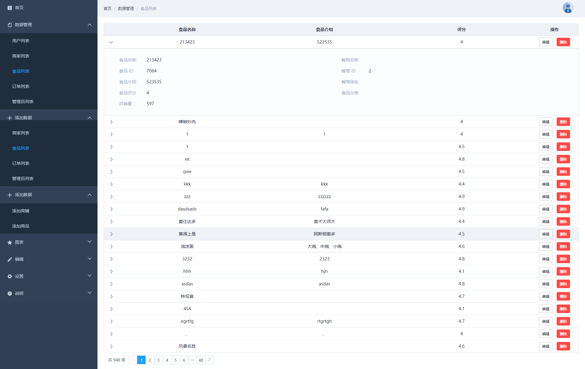
- 侧边栏导航项：商品列表、订单列表、添加商品、信息修改

#### 商家管理中心子页1 - 商品列表
- 默认状态
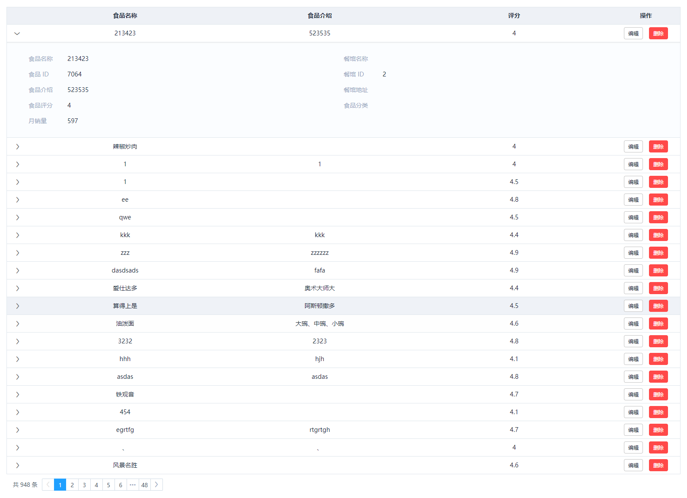
- 编辑商品
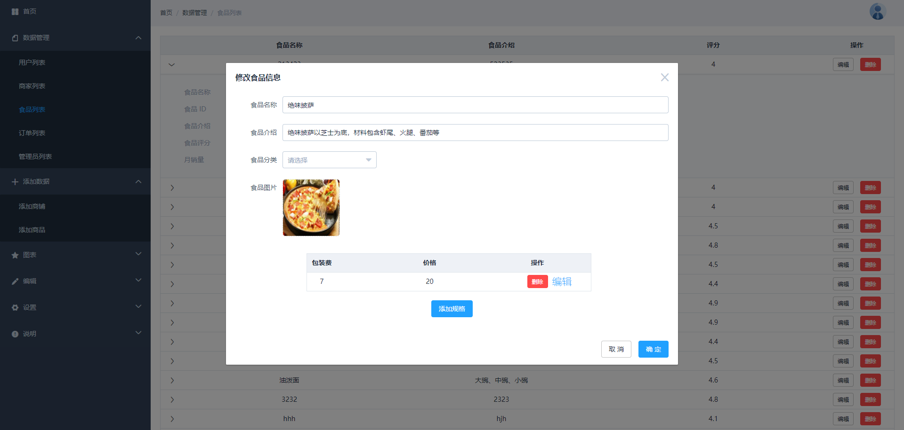

#### 商家管理中心子页2 - 订单管理
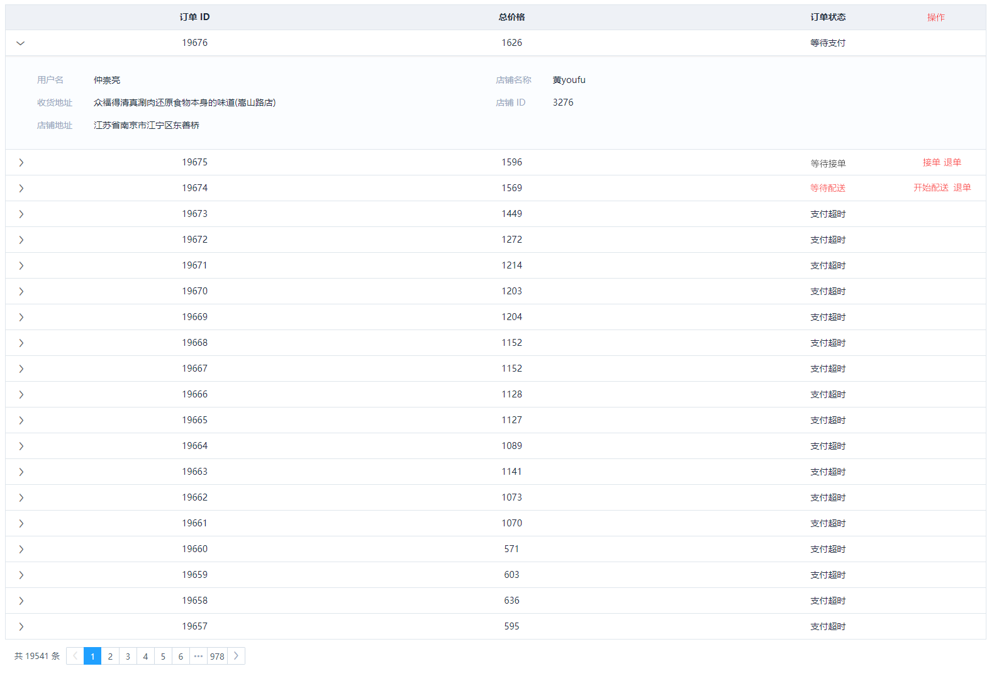

#### 商家管理中心子页3 - 添加商品
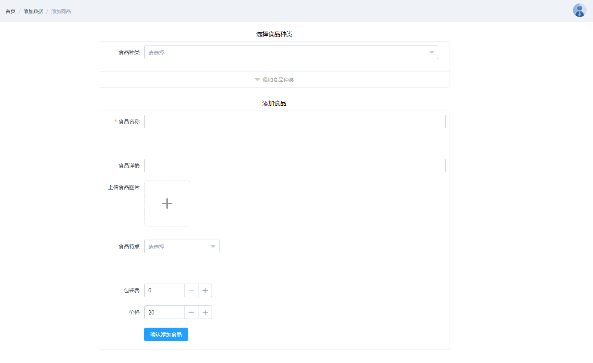

#### 商家管理中心子页4 - 信息修改
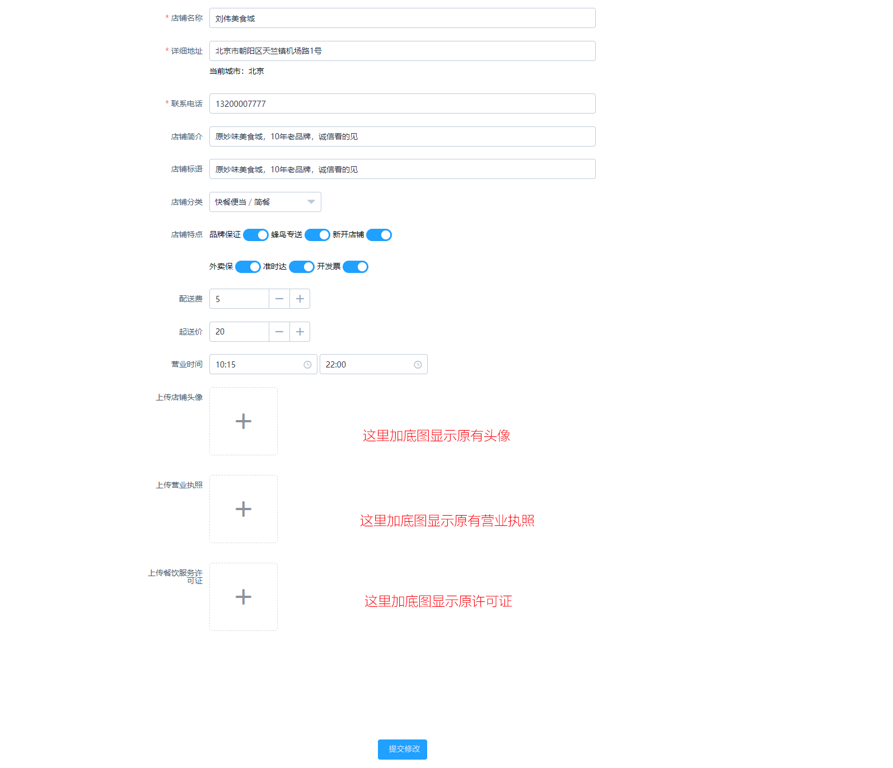

### 第五页管理中心
- 布局风格参考：第四页商家管理中心
- 侧边栏导航项：
  - 用户管理
    - 用户列表
    - 管理员列表
  - 商户家管理
    - 商户列表
    - 待审核列表
    - 添加商户
  - 订单管理
  - 开通城市
  - 数据统计
  

#### 第五页管理中心 - 1 - 用户管理

##### 第五页管理中心 - 1 - 用户管理 - 用户列表
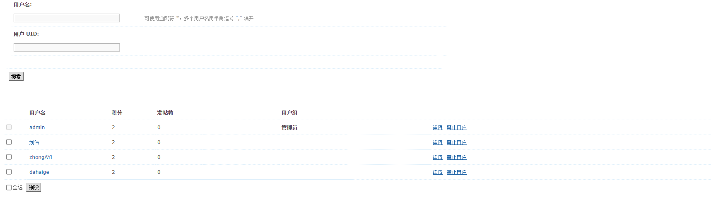;
##### 第五页管理中心 - 1 - 用户管理 - 用户详情
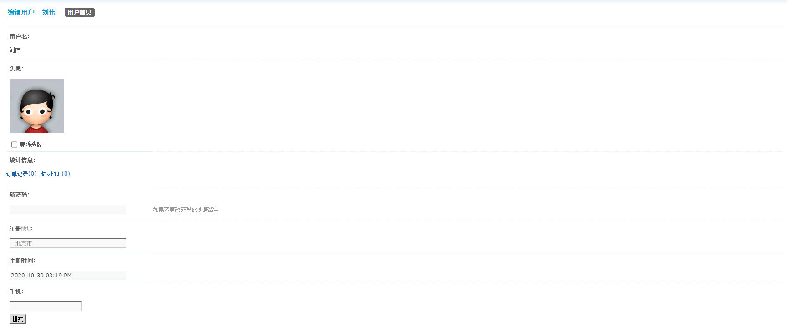
##### 第五页管理中心 - 1 - 用户管理 - 管理员列表
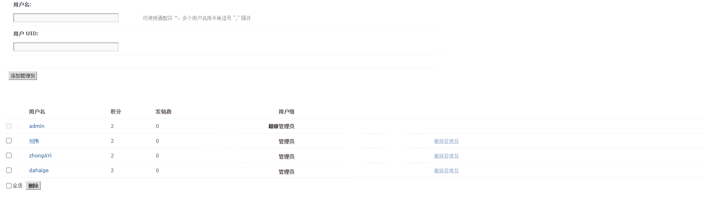

#### 第五页管理中心 - 2 - 商户家管理
#### 第五页管理中心 - 2 - 商户家管理 - 商户列表
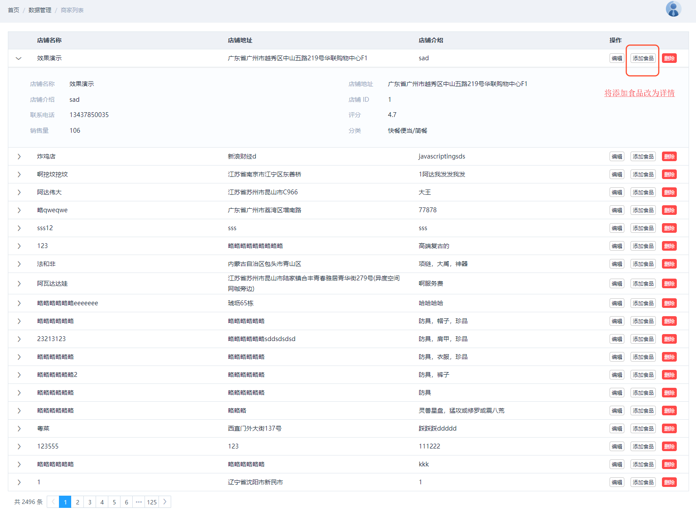
#### 第五页管理中心 - 2 - 商户家管理 - 待审核商户列表
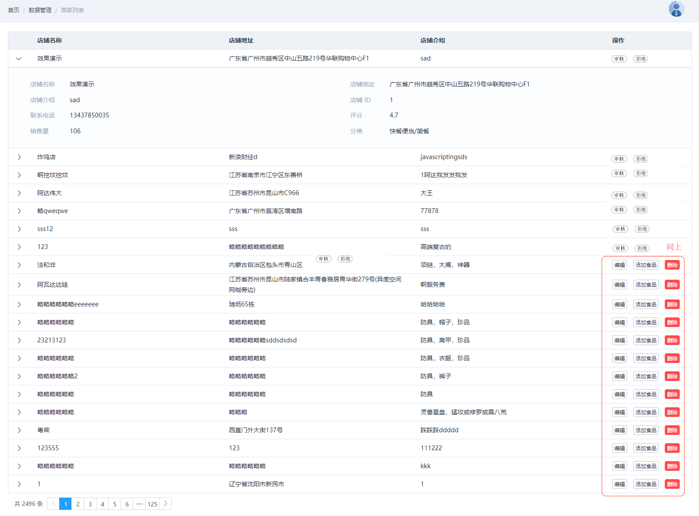
#### 第五页管理中心 - 2 - 商户家管理 - 商户详情页
无需设计
#### 第五页管理中心 - 2 - 商户家管理 - 添加商户页
无需设计

#### 第五页管理中心 - 3 - 订单列表
无需设计
#### 第五页管理中心 - 3 - 订单列表 - 订单详情
无需设计

#### 第五页管理中心 - 4 - 开通城市
无需设计
