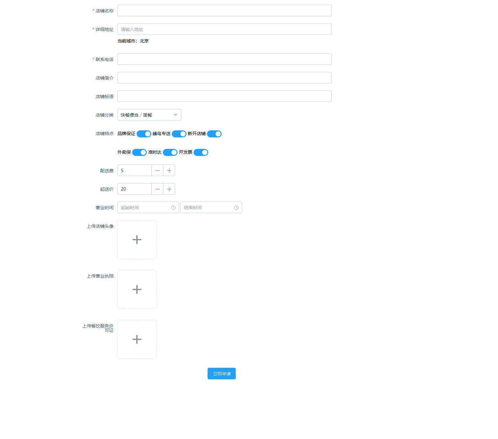

# 商城CMS - 设计需求

## UI参考

- Antd https://ant.design/components/overview-cn/
- Axure Library和Ant Design Pro Sketch资源包 https://pro.ant.design/docs/resource-cn

## 设计需求

### 第一页登录页

- 表单字段：用户名、密码、验证码、登录按钮
- 链接：商家登录、申请成为商家

### 第二页商家登录页

- 表单字段：用户名、密码、验证码、登录按钮
- 链接：申请成为商家

### 第三页商家申请页

### 第四页商家管理中心
- 布局风格：
    
- 侧边栏导航：商品列表、订单列表、添加商品、信息修改

#### 商家管理中心子页1 - 商品列表
